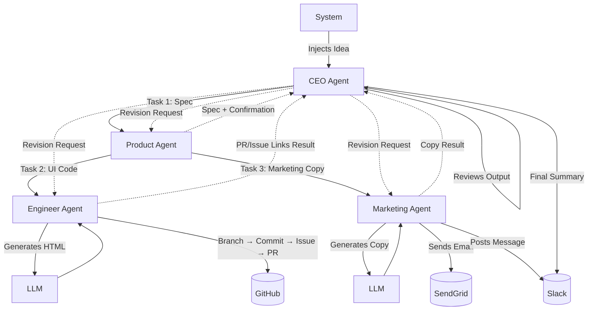

# LaunchMind: Smart Study Planner

## 🚀 Startup Idea
**Smart Study Planner** is an AI-powered study schedule generator designed for students who struggle to manage multiple exam deadlines. By taking in course subjects and exam dates, it auto-generates personalized daily study plans and sends smart reminders, ensuring students stay on track without the stress of manual planning.

## 🏗️ Agent Architecture



### Explanation of Architecture:
1. **System** injects the startup idea to the **CEO**.
2. **CEO** instructs the **Product** agent to define the product.
3. **Product** generates the structured specification and directly tasks the **Engineer** and **Marketing** agents. It also confirms back to the CEO.
4. **Engineer** generates an HTML landing page using an LLM, pushes code to GitHub, creates an issue, opens a PR, and returns the links to the CEO.
5. **Marketing** generates marketing copy, emails it via SendGrid, posts a message to Slack Block Kit, and returns the result to the CEO.
6. **CEO** reviews the results from all agents. If anything fails its strict standards, it sends back a `revision_request` forcing that agent to iterate. Otherwise, it approves.
7. Upon full approval, the **CEO** posts a final summary to Slack.

## 🛠️ Setup Instructions

### 1. Clone the repository
```bash
git clone https://github.com/Minahil-Tariq/launchmind-project.git
cd launchmind
```

### 2. Install dependencies
```bash
python -m venv venv
# Windows:
.\venv\Scripts\activate
# Mac/Linux:
source venv/bin/activate

pip install -r requirements.txt
```

### 3. Set Environment Variables
Copy `.env.example` to `.env` and fill out your keys:
```bash
cp .env.example .env
```
Ensure you provide:
- `GROQ_API_KEY`
- `GITHUB_TOKEN` (Ensure it has repo permissions)
- `GITHUB_REPO` (Format: `username/repo`)
- `SENDGRID_API_KEY`, `FROM_EMAIL`, `TO_EMAIL`
- `SLACK_BOT_TOKEN`

### 4. Run the System
```bash
python main.py
```
> **Note:** If rate limit errors happen with Groq, the system implements an organic auto-pause-and-retry. Just wait.

## 🌐 Platform Integrations

- **GitHub API (Engineer Agent):** 
  - Authenticated via Personal Access Token (`GITHUB_TOKEN`)
  - Fetches base repository SHA
  - Creates a new git branch
  - Commits the LLM-generated HTML (`index.html`) to the branch
  - Creates a GitHub Issue for tracking
  - Opens a Pull Request from the new branch to main
- **Slack API (Marketing & CEO Agents):**
  - Authenticated via Bot User OAuth Token (`SLACK_BOT_TOKEN`)
  - **Marketing Agent** uses Block Kit to post a rich message announcing the product launch with the PR URL to `#launches`.
  - **CEO Agent** posts final completion status to `#launches`.
- **SendGrid API (Marketing Agent):**
  - Authenticated via API key (`SENDGRID_API_KEY`)
  - Constructs and dispatches a cold-outreach HTML email dynamically generated by the LLM.

## 🔗 Live Links

- **GitHub Repository**: [Minahil-Tariq/launchmind-project](https://github.com/Minahil-Tariq/launchmind-project)
- **Slack Workspace / Bot**: Add an invite link or view the message in the `#launches` channel on your workspace.
- **Pull Request**: A PR is dynamically generated during the pipeline execution and its URL will print in the console!
